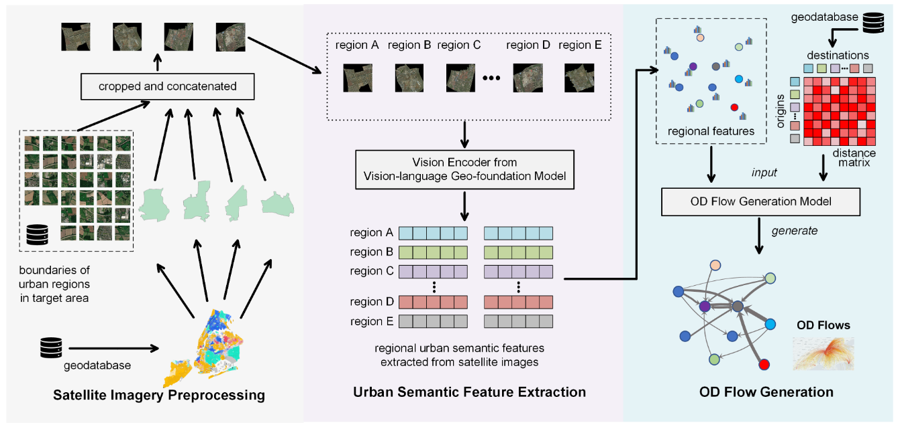

> Note: For my UCL MSc coursework, I (David Cheung) added custom scripts and notes in `docs/README_cw2.md`. These are not part of the official GlODGen project.

# GlODGen: Generate Origin-destination Matrix based-on Public Available Information on the Internet

The following code can be used to automatically obtain **Population Count** (from [**WorldPop**](https://hub-worldpop.opendata.arcgis.com/)) and **Satellite Imagery** (for [**Esri World Imagery**](https://www.arcgis.com/home/item.html?id=10df2279f9684e4a9f6a7f08febac2a9)) for a given area divided by
several regions. Based on this information, it can generate the origin-destination (OD) matrix between regions using a graph denoising diffusion model.

### Related Publication

- This is the offical repository of implementation of the paper published on NeurIPS 2025, *Satellites Reveal Mobility: A Commuting Origin-destination Flow Generator for Global Cities* ([ArXiv](https://arxiv.org/abs/2505.15870)).
- The model and dataset are closely related to a online OD flow generation demo at [https://fi.ee.tsinghua.edu.cn/worldod/].
- The generation pipeline is closely related to a generated commuting OD flow dataset for cities around the world at [Paper on ArXiv](https://arxiv.org/abs/2505.17111).

### Framework



### Code Description

```
generate_od/
├── generator.py    # Main generator class that serves as the primary entry point. Takes regional boundaries as input and orchestrates the entire OD matrix generation pipeline by integrating satellite imagery, population data, and diffusion models
├── model.py        # Core graph generative model implementations including diffusion related data and noise scheduler, denoising network of graph transformers, etc
├── sateimgs.py     # Satellite image processing module that handles downloading, tiling, concatenation, and feature extraction based on [RemoteCLIP](https://arxiv.org/abs/2306.11029)
├── utils.py        # Utility functions for distance calculations, coordinate transformations, UTM projections, and visualization of generated OD flows
└── worldpop.py     # Population data acquisition module that fetches regional population statistics from WorldPop ArcGIS services
```

### Use case

#### Commuting OD Flow Generation (MAIN)

First install the packacge by

    pip install generate-od

Then use the following code to generate OD flows.

```python
import geopandas as gpd
from generate_od import generator

if __name__ == "__main__":
    my_generator = generator.Generator()
    my_generator.set_satetoken("xxxxxxxxxxxxxxx")  # for World_Imagery, applied from ArcGIS

    area = gpd.read_file("London.shp")
    my_generator.load_area(area)
    my_generator.generate()
```

#### Worldpop Data (BONUS)

To fetch population data for your regions using WorldPop services:

```python
import geopandas as gpd
from generate_od.worldpop import worldpop

# Load your regional boundaries (shapefile or GeoDataFrame)
area_shp = gpd.read_file("your_regions.shp")

# Ensure CRS is set (will be converted to WGS84 internally)
if area_shp.crs is None:
    area_shp = area_shp.set_crs("EPSG:4326")

# Fetch population data for all regions
population_features = worldpop(area_shp, num_proc=10)

# The result contains [population, area_size] for each region
print(f"Population data shape: {population_features.shape}")
print(f"Features: [population_count, area_km2]")
```

The `worldpop()` function automatically:

- Downloads population raster data from WorldPop ArcGIS services
- Masks the raster with your regional boundaries
- Aggregates pixel values within each region
- Calculates region areas in square kilometers
- Returns a numpy array with population and area features for each region

### WorldPop population rasters

To reproduce the experiments using alternative worldpop data source, first download the WorldPop rasters:

```bash
bash download_worldpop.sh
```

#### Satellite Image Processing (BONUS)

To download and process satellite images for your regions using Esri's World Imagery service:

```python
import geopandas as gpd
from generate_od.sateimgs import area_SateImgs, extract_imgfeats_RemoteCLIP
import open_clip
import torch

# Load your regional boundaries
area_shp = gpd.read_file("your_regions.shp")

# Set your Esri token (apply at https://developers.arcgis.com/)
esri_token = "your_esri_token_here"

# Download satellite images for all regions
regional_images = area_SateImgs(area_shp, token=esri_token, num_proc=50)

# Load RemoteCLIP model for feature extraction
model_name = "RN50"  # or "ViT-B-32", "ViT-L-14"
vision_model, _, _ = open_clip.create_model_and_transforms(model_name)
device = torch.device("cuda" if torch.cuda.is_available() else "cpu")

# Extract image features using RemoteCLIP
img_features = extract_imgfeats_RemoteCLIP(
    vision_model, model_name, regional_images, device
)

print(f"Image features shape: {img_features.shape}")
print(f"Features per region: {img_features.shape[1]} dimensions")
```

The satellite image processing pipeline:

- Downloads high-resolution satellite tiles from Esri's World Imagery service
- Concatenates tiles to create regional composite images
- Applies region boundaries as masks to extract relevant areas
- Extracts 1024-dimensional visual features using RemoteCLIP
- Returns features that capture urban morphology, land use, and built environment

### Citation

Coming soon...

### Contact

Can Rong (can.rong@smart.mit.edu)
